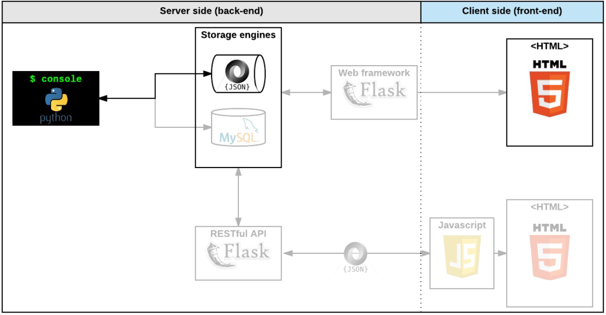

# AirBnB clone - The console & Web static


## Welcome to the AirBnB clone project description!

* Put in place a parent class (called BaseModel) to take care of the initialization, serialization and deserialization of your future instances
* Create a simple flow of serialization/deserialization: Instance <-> Dictionary <-> JSON string <-> file
* Create all classes used for AirBnB (User, State, City, Place…) that inherit from BaseModel
* Create the first abstracted storage engine of the project: File storage.
* Create all unittests to validate all our classes and storage engine


## How to start the command interpreter
Run the executable file for the console to start the command interpreter.
There are various commands we can prompt on our console:

* Create  - Creates a new instance of the given class and saves it.
* Show    - Prints a description of the specified object.
* Destroy - Destroys a specific object.
* All     - Prints all objects in storage, or all objects in storage of particular class.
* Update  - Updates one or more attributes on the specified object.


## How to use command interpreter
### interactive mode:
```
$ ./console.py
(hbnb) help

	Documented commands (type help <topic>):
	========================================
EOF  help  quit

(hbnb) 
(hbnb) 
(hbnb) quit
$
```
### non-interactive mode:
```
$ echo "help" | ./console.py
(hbnb)

	Documented commands (type help <topic>):
	========================================
EOF  help  quit
(hbnb) 
$
$ cat test_help
help
$
$ cat test_help | ./console.py
(hbnb)

	Documented commands (type help <topic>):
	========================================
EOF  help  quit
(hbnb) 
$
```

## References
- [cmd module](https://docs.python.org/3.8/library/cmd.html)
- [cmd module in depth](https://pymotw.com/2/cmd/)
- [uuid module](https://docs.python.org/3.8/library/uuid.html)
- [datetime](https://docs.python.org/3.8/library/datetime.html)
- [unittest module](https://docs.python.org/3.8/library/unittest.html#module-unittest)
- [args/kwargs](https://yasoob.me/2013/08/04/args-and-kwargs-in-python-explained/)
- [Python test cheatsheet](https://www.pythonsheets.com/notes/python-tests.html)
- [cmd module wiki page](https://wiki.python.org/moin/CmdModule)
- [python unittest](https://realpython.com/python-testing/)
- [Learn to Code HTML & CSS](https://learn.shayhowe.com/html-css/)
- [Inline Styles in HTML](https://www.codecademy.com/article/html-inline-styles)
- [Specifics on CSS Specificity](https://css-tricks.com/specifics-on-css-specificity/)
- [CSS SpeciFishity](https://www.standardista.com/cgi-sys/suspendedpage.cgi)
- [Introduction to HTML](https://developer.mozilla.org/en-US/docs/Learn/HTML/Introduction_to_HTML)
- [CSS](https://developer.mozilla.org/en-US/docs/Learn/CSS)
- [MDN](https://developer.mozilla.org/en-US/)
- [center boxes](https://css-tricks.com/centering-css-complete-guide/)
- [Flexible boxes](https://developer.mozilla.org/en-US/docs/Web/CSS/CSS_flexible_box_layout/Basic_concepts_of_flexbox)
- [Flexbox Froggy](https://flexboxfroggy.com/)

